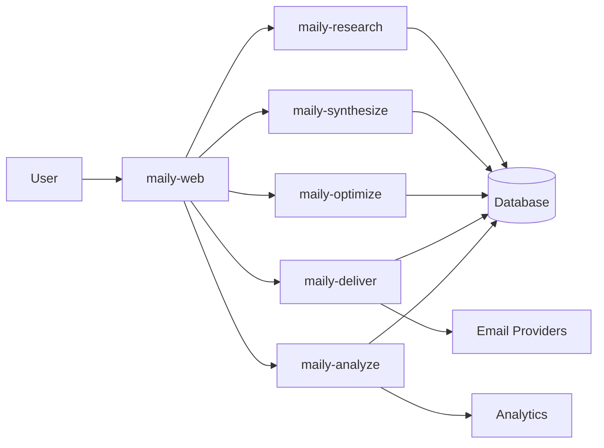

# Core Concepts

This guide explains the fundamental concepts and architecture of Maily.

## System Architecture

### Microservices

Maily is built on a microservices architecture with the following key services:

1. **maily-web**
   - Next.js frontend application
   - User interface and dashboard
   - API route handlers
   - Real-time updates

2. **maily-research**
   - Company and contact enrichment
   - Data validation and normalization
   - Search functionality
   - Competitor analysis

3. **maily-synthesize**
   - AI content generation
   - Template management
   - Personalization engine
   - A/B testing

4. **maily-optimize**
   - Campaign optimization
   - Audience segmentation
   - Send time optimization
   - Performance predictions

5. **maily-deliver**
   - Email delivery management
   - Bounce handling
   - Click tracking
   - Unsubscribe management

6. **maily-analyze**
   - Real-time analytics
   - Performance reporting
   - Audience insights
   - Revenue attribution

### Data Flow



## Core Features

### 1. Content Generation

The AI-powered content generation system:
- Uses multiple AI models for different content types
- Maintains consistent brand voice
- Supports multiple languages
- Enables personalization
- Provides content suggestions

### 2. Campaign Management

Campaign lifecycle management includes:
- Campaign creation and scheduling
- Audience targeting and segmentation
- A/B testing and optimization
- Performance tracking
- Automated workflows

### 3. Analytics & Insights

Comprehensive analytics system provides:
- Real-time performance metrics
- Audience behavior analysis
- Revenue attribution
- Predictive analytics
- Custom reporting

### 4. Automation & Workflows

Automation capabilities include:
- Triggered campaigns
- Drip sequences
- Behavioral triggers
- Multi-channel coordination
- Custom workflow builders

## Data Model

### Projects

Projects are the top-level organizational unit:
```typescript
interface Project {
  id: string
  name: string
  description?: string
  settings: ProjectSettings
  createdAt: Date
  updatedAt: Date
}
```

### Campaigns

Campaigns represent email marketing initiatives:
```typescript
interface Campaign {
  id: string
  projectId: string
  name: string
  description?: string
  templateId: string
  audience: AudienceConfig
  schedule: ScheduleConfig
  status: CampaignStatus
  metrics: CampaignMetrics
  createdAt: Date
  updatedAt: Date
}
```

### Templates

Templates define reusable email content:
```typescript
interface Template {
  id: string
  projectId: string
  name: string
  description?: string
  subject: string
  content: string
  variables: string[]
  category: TemplateCategory
  createdAt: Date
  updatedAt: Date
}
```

### Analytics

Analytics data structure:
```typescript
interface Analytics {
  campaignId: string
  timestamp: Date
  metrics: {
    sends: number
    opens: number
    clicks: number
    conversions: number
    revenue: number
  }
  segments: Record<string, number>
  devices: Record<string, number>
  locations: Record<string, number>
}
```

## Security Model

### Authentication

Multiple authentication methods:
- JWT tokens for API access
- API keys for service-to-service
- Session cookies for web interface
- OAuth for integrations

### Authorization

Role-based access control (RBAC):
- Owner: Full system access
- Admin: Project management
- Editor: Content and campaign management
- Viewer: Read-only access
- API: Limited programmatic access

### Data Protection

Security measures include:
- End-to-end encryption
- Data anonymization
- Access logging
- Audit trails
- Compliance monitoring

## Integration Points

### Email Service Providers
- SMTP providers
- Transactional email services
- Dedicated IP pools
- Deliverability monitoring

### Analytics Platforms
- Google Analytics
- Mixpanel
- Custom analytics
- Data warehouses

### CRM Systems
- Salesforce
- HubSpot
- Custom CRM
- Data sync

### Marketing Tools
- Ad platforms
- Social media
- Landing pages
- Form builders

## Best Practices

### Performance
- Use caching effectively
- Implement rate limiting
- Optimize database queries
- Monitor resource usage

### Security
- Follow security guidelines
- Implement proper validation
- Use security headers
- Monitor for threats

### Scalability
- Design for horizontal scaling
- Use efficient data structures
- Implement proper caching
- Monitor performance

### Reliability
- Implement error handling
- Use retry mechanisms
- Monitor system health
- Maintain backups

## Development Workflow

### Code Organization
- Follow modular design
- Use TypeScript
- Implement testing
- Document code

### Deployment
- Use CI/CD pipelines
- Implement monitoring
- Configure alerts
- Maintain logs

### Maintenance
- Regular updates
- Security patches
- Performance optimization
- System monitoring

## Support & Resources

- Documentation: [docs.maily.app](https://docs.maily.app)
- API Reference: [api.maily.app](https://api.maily.app)
- Community: [community.maily.app](https://community.maily.app)
- Status: [status.maily.app](https://status.maily.app)